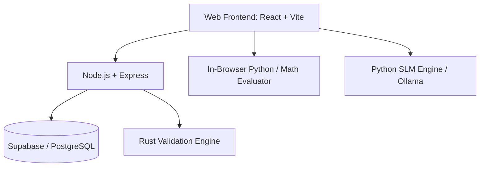

<div align="center">
  

  # 🌌 Living Science Grid

  **An Advanced Ecosystem for Mathematical Evaluation, Research Analysis, and Scientific Collaboration**

  [](https://reactjs.org/)
  [](https://vitejs.dev/)
  [](https://nodejs.org/)
  [](https://python.org)
  [](https://www.rust-lang.org/)
  [](https://supabase.com/)
  [](https://ollama.ai/)
</div>

---

## 📖 Table of Contents
- [✨ Features](#-features)
- [🏗️ Architecture Overview](#-architecture-overview)
- [🚀 How to Run](#-how-to-run)
  - [Prerequisites](#prerequisites)
  - [1. Backend Setup](#1-backend-setup)
  - [2. Frontend Setup](#2-frontend-setup)
  - [3. AI Engine Setup (Optional/Advanced)](#3-ai-engine-setup)
  - [4. Validation Engine (Rust)](#4-validation-engine)

---

## ✨ Features

We have built a unified workspace for scientists, researchers, and students. Here are the core modules available:

### 🧮 1. Math Evaluator
A high-performance Python-based calculation engine running directly in the browser via Pyodide. Evaluate complex equations, run fast computations, and solve mathematical expressions instantly.

### 🕸️ 2. Domain Matrix
An interactive 2D node-based knowledge graph. Connect scientific concepts, research papers, and equations visually to map out your understanding of complex domains.

### 🔍 3. Insight Lens
A specialized AI-powered analysis view. Features include:
- **Study Mode & Copilot Chatting:** Talk to a personally trained Small Language Model (SLM) for deep research insights.
- **Translation:** English to Bangla neural translation with audio stream capabilities.

### 🏦 4. Central Vault
Your personal global vault and unified storage interface. Organize research documents, manage notes sections, datasets, and personal knowledge graphs in one secure location.

### 🔬 5. Scholar Audit
A robust evaluation and verification framework. It performs automated searches, evaluates papers, and ensures that computations and data are rigorously validated.

---

## 🏗️ Architecture Overview

The system is designed as a distributed grid, ensuring high performance across web clients, backend databases, and AI servers.



| Component | Stack | Directory | Purpose |
| :--- | :--- | :--- | :--- |
| **Frontend** | React, Vite, Tailwind CSS | `/living-science-grid` | The user interface, graphs (React-force-graph), and Pyodide integration. |
| **Backend** | Node.js, Express, Supabase | `/living-science-grid/server` | Handles authentication, profile settings, API routing, and DB transactions. |
| **AI Engine** | Python, Ollama | `/living-science-grid/server` | Powers the custom SLM, Copilot chatting, and semantic searches. |
| **Validation** | Rust, Cargo | `/validation-engine` | High-performance backend component for robust validation of scientific data. |

*(Note: Developer Tools and Layer 7 API components have been excluded from this overview.)*

---

## 🚀 How to Run

Follow these steps to get the Living Science Grid up and running on your local machine.

### Prerequisites
- [Node.js](https://nodejs.org/) (v18+)
- [Python](https://python.org/) (v3.10+)
- [Rust & Cargo](https://rustup.rs/) (for the validation engine)
- [Ollama](https://ollama.ai/) (for local AI features)

### 1. Backend Setup

The backend connects to Supabase/PostgreSQL and serves as the primary API.

```bash
cd living-science-grid/server
npm install
# Set up your environment variables (e.g., Supabase URL and Keys) in a .env file
node index.js &
```
*(The backend runs on port 3000 by default)*

### 2. Frontend Setup

The frontend uses Vite for ultra-fast compilation and HMR.

```bash
cd living-science-grid
npm install
npm run dev &
```
*(The app will be accessible at `http://localhost:5173`)*

### 3. AI Engine Setup

To enable the Insight Lens copilot, translation, and custom SLM features, you need to run the local AI engine.

```bash
cd living-science-grid
# Install Python dependencies
pip install -r server/requirements.txt # if available, otherwise install manually
# Start Ollama and setup models
python setup_ollama.py
# Run the SLM Engine
python server/slm_engine.py &
```

### 4. Validation Engine

To run the Rust-based validation module:

```bash
cd validation-engine
cargo build --release
cargo run &
```

---
<div align="center">
  <i>Built with ❤️ for the scientific community.</i>
</div>
